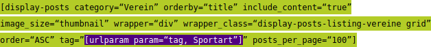
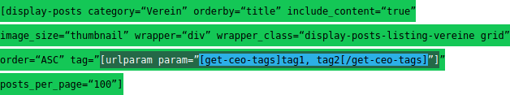
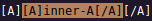

# Wordpress Plugin Recursive Shortcode

## About

The **Recursive Shortcode** plugin provides the `[recursive-shortcode]` shortcode for
[Wordpress](https://wordpress.org/) to use shortcodes in shortcodes.

## Installation

### From within dashboard (recommended)

1. Navigate to Dashboard – Plugins – Add New;
2. Search for Recursive Shortcode;
3. Click Install, then Activate.

### Manual installation

1. Download the plugin as a `.zip` file;
2. Unzip downloaded archive and upload the `recursive-shortcode` folder under your `/wp-content/plugins/` directory (resulted plugin path should be `/wp-content/plugins/recursive-shortcode/`);
3. Navigate to Dashboard – Plugins and activate the plugin.

## Usage

Using the shortcode like:

```md
[recursive-shortcode]CONTENT[/recursive-shortcode]
```

All shortcodes within the content are evaluated with the [do_shortcode()](https://developer.wordpress.org/reference/functions/do_shortcode/) function.

### Parameters

`deconstruct=true` Default: `false`

`open="REGULAR-EXPRESSION"` Default: `open="\\["`

`close="REGULAR-EXPRESSION"` Default: `close="\\]"`

#### `deconstruct=true`

The `deconstruct=true` parameter outputs a (randomly colored) evaluation hierarchy. Use this parameter to check, if the content is evaluated in the wanted way.

Example 1:

```md
[recursive-shortcode deconstruct=true][display-posts category="Verein" orderby="title" include_content="true" image_size="thumbnail" wrapper="div" wrapper_class="display-posts-listing-vereine grid" order="ASC" tag="[urlparam param="tag, Sportart"]" posts_per_page="100"][/recursive-shortcode]
```

Results in:



Example 2 - More nested shortcodes:

```md
[recursive-shortcode deconstruct=true][display-posts category="Verein" orderby="title" include_content="true" image_size="thumbnail" wrapper="div" wrapper_class="display-posts-listing-vereine grid" order="ASC" tag="[urlparam param="[get-ceo-tags]tag1, tag2[/get-ceo-tags]"]" posts_per_page="100"][/recursive-shortcode]
```

Results in:



The inner shortcode `get-ceo-tags` is evaluated first, then `urlparam`, then `display-posts`.

#### `open="REGULAR-EXPRESSION"`

Regular expression for the open brace of a shortcode. In normal written text this is a single `[`.

Since `[` has a special meaning in regular expressions, you have to escape it with `\`, to search it literally.

Because `\` has a special meaning in shortcode parameters, you have to escape it with `\`.

So escape all regular expression special characters with two **`\\`**.

Default value: `open="\\["`

For regular expressions see here: [PCRE Patterns](https://www.php.net/manual/pcre.pattern.php)

#### `close="REGULAR-EXPRESSION"`

Regular expression for the open brace of a shortcode. In normal written text this is a single `]`.

Since `]` has a special meaning in regular expressions, you have to escape it with `\`, to search it literally.

Because `\` has a special meaning in shortcode parameters, you have to escape it with `\`.

So escape all regular expression special characters with two **`\\`**.

Default value: `close="\\]"`

For regular expressions see here: [PCRE Patterns](https://www.php.net/manual/pcre.pattern.php)

## Pitfalls

The Wordpress shortcode syntax is not explicit. And this piece of software do not the right guess, what's correct.

Example: `[A][A]inner-a[/A][/A]` 

Possible correct interpretations:

1. We have a inner shortcode `[A]inner-a[/A]`, enclosed by an outer shortcode `[A][A]inner-a[/A][/A]`. This is the way `[recursive-shortcode]`interprets the text.
   

2. We have a leading shortcode `[A]` with no closing tag. Followed by an shortcode  `[A]inner-a[/A][/A]` with `inner-A[/A]` as content. Correct syntax, but not what you want.


Example: `[A][B param="[/A]"][/A]`

We have a inner shortcode `B` and an outer, enclosing, shortcode `A`. Correct, but not recognized by Wordpress or this shortcode.

`[recursive-shortcode]`interprets it in this way:  The `"][/A]` at the end will be displayed as normal text.

### Clues

1. Use `deconstruct=true` to get the picture of the evaluation hierarchy from this shortcut.

2. Alter the regular expressions for opening and closing braces to use `[` and `]` literally.

Example - Altered braces: `[recursive-shortcode open="@OPEN" close="@CLOSE"]@OPENA@CLOSE@OPENB param="[/A]"@CLOSE@OPEN/A@CLOSE[/recursive-shortcode]`

Is interpreted as: 

Before `do_schortcode()` is called, custom braches are replaced with standard shortcode braces.
